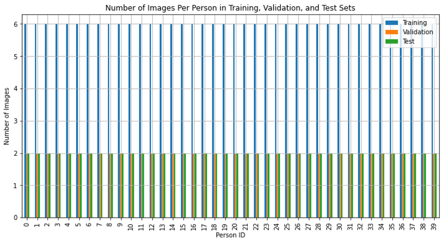
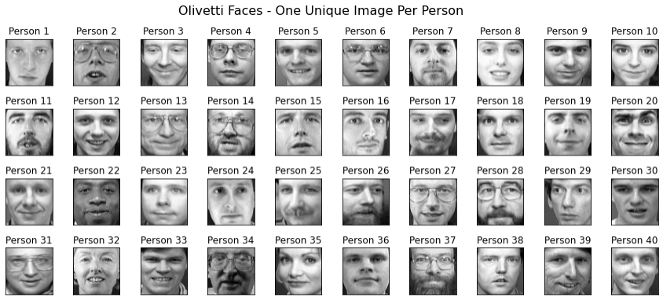
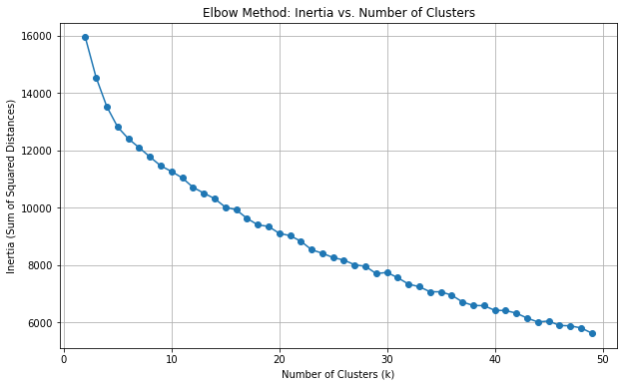
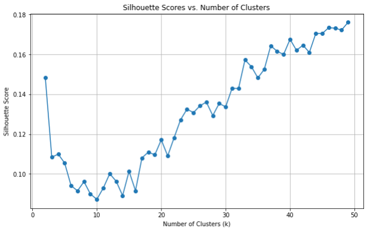
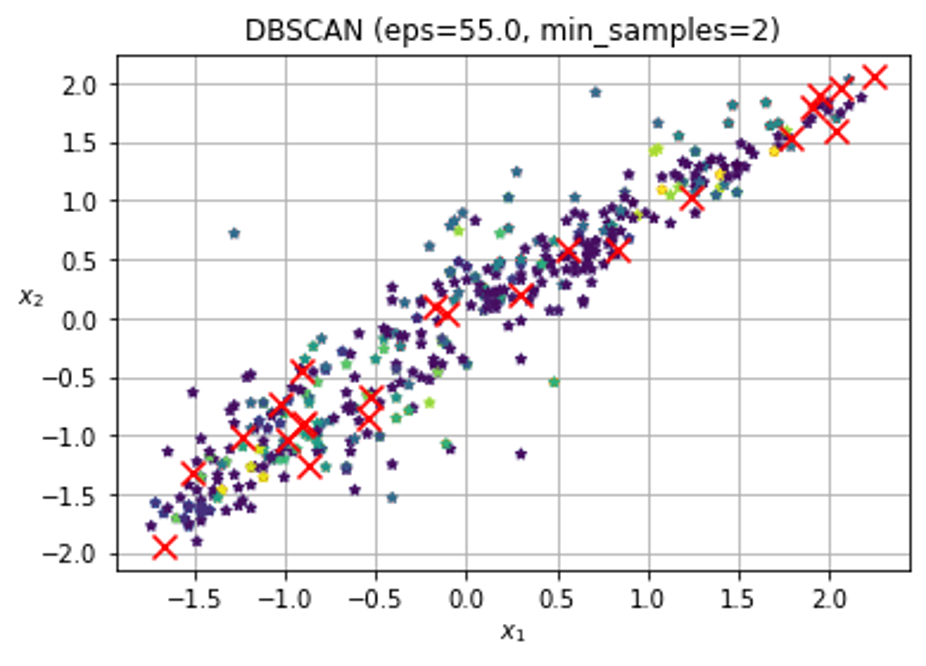
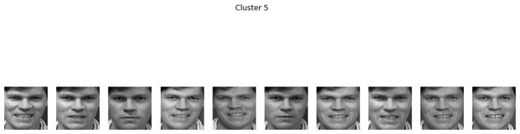
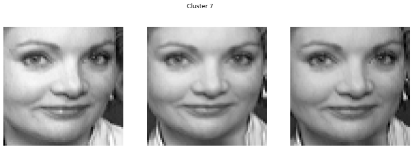
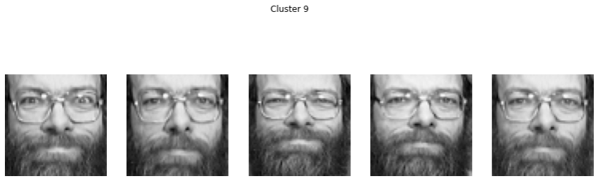

# Clustering Olivetti Faces with K-Means and DBSCAN

## 1. Loading the Olivetti Faces Dataset

The **Olivetti Faces Dataset** consists of 400 grayscale images, each of size 64x64 pixels, representing **40 unique individuals**. Each individual has 10 different images in the dataset, leading to a total of 400 images. These images are flattened into feature vectors of length **4096** (64x64 pixels).

- **Dataset:** 400 images of 40 individuals.
- **Image Size:** 64x64 pixels, resulting in a flattened feature vector of length 4096.
- **Total Images:** 400.
  
The dataset is loaded using the `fetch_olivetti_faces` function from the `sklearn.datasets` module. This converts the images into feature vectors and provides corresponding labels for clustering and classification tasks.

## 2. Stratified Split of the Dataset

### Objective
To perform a stratified split of the dataset into **training (60%)**, **validation (20%)**, and **test (20%)** sets. The goal is to ensure that each person is equally represented across all splits.

### Rationale for Split
A 60-20-20 split ensures that:
- **Training Set:** Each person has 6 images.
- **Validation Set:** Each person has 2 images.
- **Test Set:** Each person has 2 images.

This split ensures a balanced distribution and avoids the issue of having too few images in the validation and test sets, which would occur in an 80-10-10 split.

### Visualization
The chart below shows the number of images per person in each split, confirming an equal distribution across training, validation, and test sets.

## 3. Support Vector Classifier (SVC) Performance

### Objective
To train a **Support Vector Classifier (SVC)** with a **linear kernel** on the training set and evaluate its performance on the validation set.

### Cross-Validation
A **stratified 5-fold cross-validation** was performed on the training set to measure the robustness of the SVC model.

### Key Results
- **Cross-Validation Accuracy:** The SVC model achieved high accuracy across the folds.
- **Validation Accuracy:** After training on the entire training set, the model was evaluated on the validation set, with its accuracy recorded.

## 4. K-Means Clustering and Silhouette Analysis

### Objective
To apply **K-Means clustering** on the training set using a range of cluster numbers (from 2 to 50). The **elbow method** and **silhouette scores** were used to determine the optimal number of clusters.

### Visualization

- **Elbow Method:** The plot of inertia (sum of squared distances) vs. the number of clusters helps identify the "elbow point," indicating the ideal number of clusters.
  
  

- **Silhouette Scores:** A plot of silhouette scores vs. the number of clusters is shown below, with higher scores indicating better-defined clusters.

  

### Key Observations
- The **elbow point** suggested an ideal number of clusters close to **40**, which aligns with the fact that there are 40 distinct individuals in the dataset.
- The **silhouette analysis** confirmed this observation, with 40 clusters yielding a reasonably high score.

## 5. Dimensionality Reduction Using K-Means

### Objective
To reduce the dimensionality of the dataset using **K-Means clustering**. Each image was replaced by its distance (affinity) to each of the 40 cluster centers, reducing the dimensionality from **4096 to 40**.

### Training and Validation
- After dimensionality reduction, the SVC classifier was retrained on the reduced feature vectors.
- The **validation accuracy** post-dimensionality reduction was computed and compared with the original classifier's performance.

### Key Observations
Despite the significant reduction in dimensionality, the model retained useful information for classification, achieving a **validation accuracy of 82.5%**.

## 6. DBSCAN Clustering

### Objective
To apply **DBSCAN (Density-Based Spatial Clustering of Applications with Noise)** for grouping similar images based on density. The `eps` value was varied to find the optimal number of clusters, aiming for **30 to 50 clusters** with minimal noise.

### Process
- DBSCAN was applied to the scaled dataset, varying `eps` between 25 and 65.
- A higher `eps` value was chosen due to the dataset's high dimensionality (4096 features).
  
### Key Observations
- The number of clusters and noise points were printed for each `eps` value.
- The **best `eps`** was identified based on the number of clusters and the noise ratio.
- The **silhouette score** for the best `eps` was calculated, indicating clustering quality.

**Result:**
- **32 clusters** were formed with a silhouette score greater than 0.

  

## 7. Visualization of Clustered Images

To validate the performance of the clustering algorithms, several images from the dataset were visualized, highlighting clusters formed by both **K-Means** and **DBSCAN**.

### Clusters 5, 7, and 9:
Here are sample visualizations of images in clusters 5, 7, and 9 from the DBSCAN clustering results.

- **Cluster 5:**
  

- **Cluster 7:**
  

- **Cluster 9:**
  

## Conclusion

The combination of **K-Means** and **DBSCAN** provided valuable insights into the clustering of the Olivetti faces dataset:

1. **K-Means** was used for both clustering and dimensionality reduction, yielding 40 clusters with a high silhouette score.
2. **DBSCAN** was employed to discover density-based clusters, resulting in 32 clusters with minimal noise and a reasonable silhouette score.

These findings demonstrate the effectiveness of both methods in clustering high-dimensional image data and suggest that combining clustering and classification techniques can lead to efficient and meaningful models.